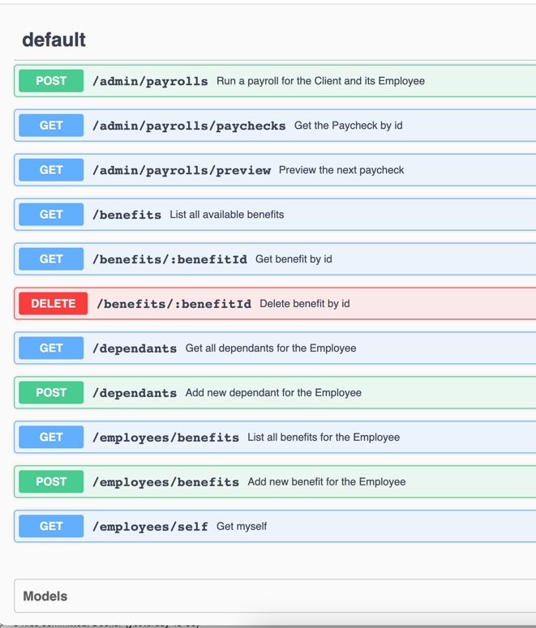
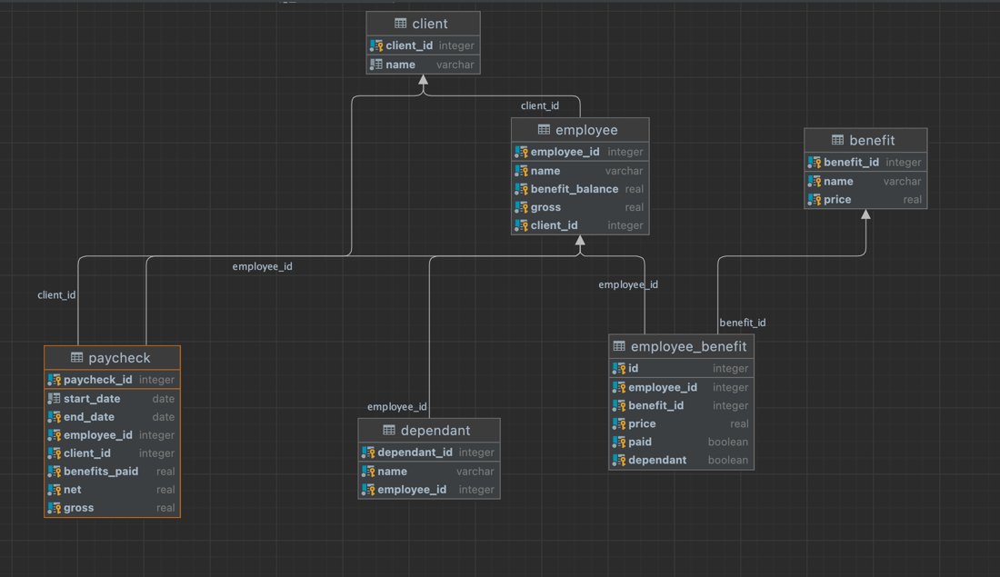

# Paylocity Payroll Server

This is an example of a RESTfull API microservice for payrolls. Data is stored into Posgres Database.
The Service does not have Authentication nor Authorization. Instead, it assumes the Auth Server (Nginx for example) would
resolve the JWT token and insert Http Headers into the original request and then pass it over to the Service.
The service is looking for those headers like: `p__employee_id` and `p__client_id` for the Employee ID and Client ID respectively.
Authorization can also be done in Nginx either base on the `path` or by introducing scopes directly into JWT.
If authorization is not possible in Nginx a Filter can be added into this Java code that would resolve the JWT and insert 
the employeeID and clientID directly into http context that can be then accessed from the Resource classes.
The Service is just an example and assumes somewhat low load. Additional indices are needed in the database and performance tuning.
It also assumes all benefits are available for all the Clients.
The service exposes 2 ports: `8080` and `8081`. The first one is the public port used by the Clients/Employees and the 
second one is the Admin port that is supposed to be open just for the administrators to run the healthchecks, change of log level,
GC clean up :)...
The service will create the db schema on the first run and in a case of a schema change it would update the schema version accordinally.
The schema is defined in: `V1__init.sql`. And some initial rows are inserted in `V2__populate_data.sql`
The config file is `paylocity.yaml`. In order to override the values from the config file just set the corresponding env var
like: `$DB_URL` or `$GROSS_SALARY`

## How to build it (`Dockerfile`)
```agsl
$ docker build -t paylocity .
```

## How run it (`docker-compose.yaml`)
```agsl
$ docker-compose up
```

## Nah, I'm an ol' school
```agsl
$ brew install postgres
$ createdb paylocity
$ mvn package
$ java -jar target/paylocity.jar -Ddw.allowanceDependant=600 server paylocity.yaml 
```

## To run some tests using cUrl
Refer to `tests/tests.http` file. Open the file in some good IDE (like Goland) and run the tests 

## API Documentation
In order to see the API documentation start the service and go to: http://localhost:8080/api/v1/swagger#/default

## Prometheus metrics
To see the runtime metrics go to: http://localhost:8080/metrics

## Swagger
 

## Database schema
